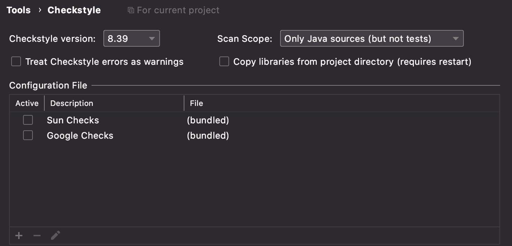
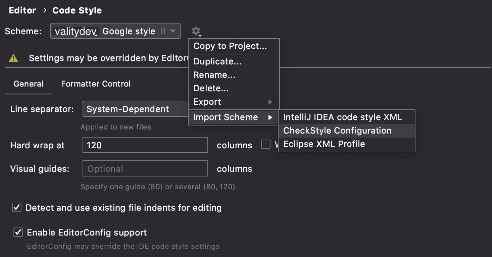

# java-checkstyle-config
Our check style config based on Google style

Usage example:

```xml
<plugin>
  <groupId>org.apache.maven.plugins</groupId>
  <artifactId>maven-checkstyle-plugin</artifactId>
  <version>3.1.2</version>
  <dependencies>
    <dependency>
      <groupId>com.puppycrawl.tools</groupId>
      <artifactId>checkstyle</artifactId>
      <version>8.41</version>
    </dependency>
  </dependencies>
  <executions>
    <execution>
      <id>validate</id>
      <phase>validate</phase>
      <configuration>
        <configLocation>${checkstyle.config.path}</configLocation>
        <encoding>UTF-8</encoding>
        <failsOnError>true</failsOnError>
        <consoleOutput>true</consoleOutput>
        <violationSeverity>warning</violationSeverity>
        <includeTestSourceDirectory>true</includeTestSourceDirectory>
        <suppressionsLocation>${checkstyle.config.suppressions.path}</suppressionsLocation>
      </configuration>
      <goals>
        <goal>check</goal>
      </goals>
    </execution>
  </executions>
</plugin>
```

### SuppressWarnings examples

First path — override `${checkstyle.config.suppressions.path}` in project with `checkstyle-suppressions.xml` file and fill with your filters

pom.xml:
```xml
<properties>
    <checkstyle.config.suppressions.path>./src/main/resources/checkstyle/checkstyle-suppressions.xml</checkstyle.config.suppressions.path>
</properties>
```

checkstyle-suppressions.xml:
```xml
<?xml version="1.0"?>

<!DOCTYPE suppressions PUBLIC
        "-//Checkstyle//DTD SuppressionFilter Configuration 1.0//EN"
        "https://checkstyle.org/dtds/suppressions_1_0.dtd">

<suppressions>
        <suppress checks="LineLength"
                  files="AppConfig.java"
                  lines="0-9999"/>
</suppressions>
```

Other path — use `@SuppressWarnings`:
```java 
@SuppressWarnings({"checkstyle:%module_name%", "checkstyle:%module_name%""})
``` 

Example:
```java 
@SuppressWarnings({"checkstyle:parametername", "checkstyle:localvariablename"})
``` 

# Написание исходного кода

Набор рекомендаций по подходу к написанию, оформлению и форматированию исходного кода на Java.

## Оформление

Поддержание единого code style осуществляется за счет использования `maven-checkstyle-plugin` с настроенным под наc [google style конфигом](https://github.com/rbkmoney/java-checkstyle-config).

Вам **не нужно вручную добавлять плагин** в свой проект. Чаще всего, будет достаточно использовать подходящий parent pom.

#### Для Spring проекта:
```xml
<parent>
    <groupId>com.rbkmoney</groupId>
    <artifactId>service-parent-pom</artifactId>
    <version></version>
</parent>
```

#### Для любого другого java проекта:
```xml
<parent>
    <groupId>com.rbkmoney</groupId>
    <artifactId>library-parent-pom</artifactId>
    <version></version>
</parent>
```

**Важно**. Лучше если вы воспользуетесь нашим шаблонизатором для создания проектов [rbk-templator](https://github.com/rbkmoney/rbk-templator).
Это удобно, в том числе, для того чтобы не следить за последними версиями parent pom.

**Важно**. Если у вас цель модифицировать check style под свой проект - используйте property `checkstyle.config.path` с указанием пути до файла конфигурации:
```xml
<properties>
    <checkstyle.config.path>custom_google_checkstyle.xml</checkstyle.config.path>
</properties>
```

### Форматирование кода в IntelliJ IDEA

#### Realtime проверка стиля

Для проверки стиля в realtime воспользуйтесь [плагином](https://plugins.jetbrains.com/plugin/1065-checkstyle-idea)

После установки плагина необходимо подключить наш файл конфигурации стилей. Это можно сделать в разделе `Tools > CheckStyle`, в настройках `IDEA`.



Актуальный файл конфигурации стилей можно взять из нашего [репозитория](https://raw.githubusercontent.com/rbkmoney/java-checkstyle-config/master/conf/rbkmoney_google_checkstyle.xml)

#### Автоформатирование кода

Чтобы воспользоваться автоформатированием кода - импортируйте [файл конфигурации стилей](https://raw.githubusercontent.com/rbkmoney/java-checkstyle-config/master/conf/rbkmoney_google_checkstyle.xml) в `Code Style` вашей `IntelliJ IDEA`



Далее вы можете использовать эту схему для конкретного проекта или глобально.

Форматирование осуществляется через вызов `Code > Reformat Code` в `IDEA`.

**Важно**. Если у вас на CI check style падает с ошибкой, а у себя в локальной среде вы не видите ошибок форматирования кода - убедитесь, что используете актуальный [файл конфигурации стилей](https://raw.githubusercontent.com/rbkmoney/java-checkstyle-config/master/conf/rbkmoney_google_checkstyle.xml) в `IntelliJ IDEA` 

## Краткое описание классов

В шапке каждого класса хорошим тоном будет указывать небольшое описание того, зачем этот класс нужен и что он делает.

